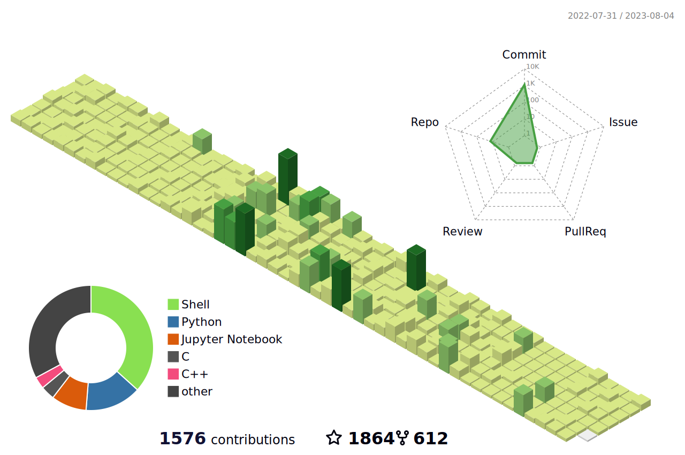

# 😎 Hey! Nice to see you.

<!--   my-icons -->

    
    
    
    

<!--   my-header-img -->

#### I'm louis, a developer from 🇨🇳China.

### Things I code with

  
  
  
  
  
  
  
  
  
  
  
  
  
  
  
  
  
  
  
  
  
  
  
  
  

<h3>Open source projects</h3>
<table>
  <thead align="center">
    <tr border: none;>
      <td><b>🎁 Projects</b></td>
      <td><b>⭐ Stars</b></td>
      <td><b>📚 Forks</b></td>
      <td><b>🛎 Issues</b></td>
      <td><b>📬 Pull requests</b></td>
    </tr>
  </thead>
  <tbody>
    <tr>
      <td><a href="https://github.com/pm6422/luix-passport"><b>LUIX Passport</b></a></td>
      <td></td>
      <td></td>
      <td></td>
      <td></td>
    </tr>
    <tr>
      <td><a href="https://github.com/pm6422/luix-commons"><b>LUIX Commons</b></a></td>
      <td></td>
      <td></td>
      <td></td>
      <td></td>
    </tr>
    <tr>
      <td><a href="https://github.com/pm6422/luix-rpc"><b>LUIX RPC</b></a></td>
      <td></td>
      <td></td>
      <td></td>
      <td></td>
    </tr>
    <tr>
      <td><a href="https://github.com/pm6422/luix-fraud-detection"><b>LUIX Fraud Detection</b></a></td>
      <td></td>
      <td></td>
      <td></td>
      <td></td>
    </tr>
  </tbody>
</table>

<!-- github stats graph -->

</img>

<!--   profile-green-animate -->

### Shanghai scenery
##### Shanghai is a metropolis full of youth, combining modernity with classics, and there are many job opportunities. Welcome friends from all over the world to travel and work.

   
   
  

<!--
**pm6422/pm6422** is a ✨ _special_ ✨ repository because its `README.md` (this file) appears on your GitHub profile.

Here are some ideas to get you started:

- 🔭 I’m currently working on ...
- 🌱 I’m currently learning ...
- 👯 I’m looking to collaborate on ...
- 🤔 I’m looking for help with ...
- 💬 Ask me about ...
- 📫 How to reach me: ...
- 😄 Pronouns: ...
- ⚡ Fun fact: ...
-->

